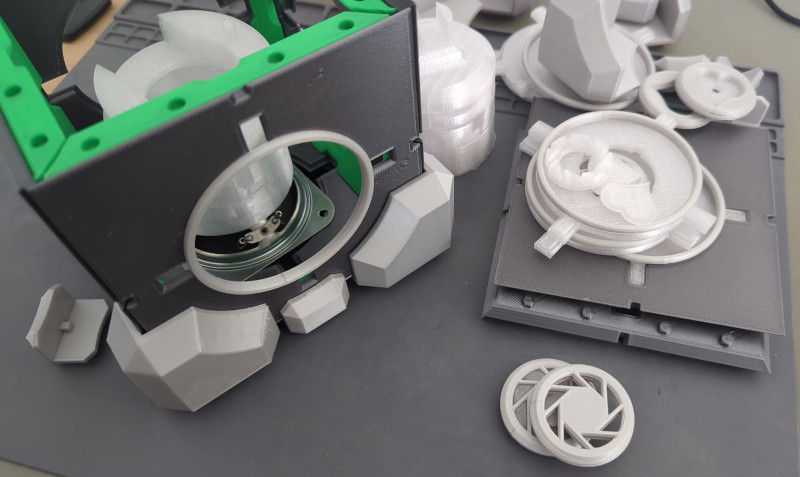
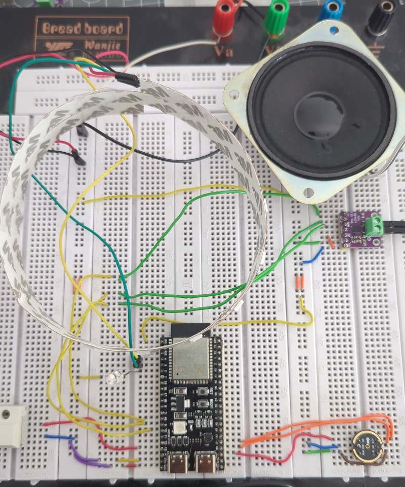

# Voice Assistant for HA

After playing around with different hardwares and the settings (see [here](https://github.com/FlorianBr/ESPHome.Assist)) I started to create a (more or less) final voice assistant including case and so on

## The case

The case is based on a 3D printed Companion Cube made by woodyhead101 available on [thingiverse](https://www.thingiverse.com/thing:6468441)

The parts are not modified, I simply added a holder for the microphone and ESP32.

## The hardware

The ESP32 is a chinese clone of Espressifs ESP32-S3-DevKitC with slightly different pinning. The on-board RGB-LED is at IO48 instead of IO38 for example.

On the breadboard I still have an additional LED and a Mute-button, both removed in the final design.

### Pinnings

#### MAX98357

- LRC  - not connected
- BCK  - ESP32 GPIO9
- DIN  - ESP32 GPIO10
- GAIN - not connected
- SD   - VDD (Channel left selected)
- GND  - GND
- VDD  - ESP32 3v3

#### INMP441

- SCK - ESP32 GPIO21
- WS  - ESP32 GPIO20
- L/R - GND
- SO  - ESP32 GPIO19
- VDD - ESP32 3v3
- GND - GND

#### LED Strip

- 5V  - 5V
- CI  - ESP32 GPIO5
- DI  - ESP32 GPIO4
- GND - GND

#### ESP32

- GPIO4  - LED Strip DI
- GPIO5  - LED Strip CI
- GPIO9  - MAX98357 BCK
- GPIO10 - MAX98357 DIN
- GPIO19 - INMP441 SO
- GPIO20 - INMP441 WS
- GPIO21 - INMP441 SCK
- GPIO46 - MAX98357 DIN
- GPIO48 - On-Board RGB-LED

## The software

A ESPHome Voice Assistant with LED-Strip, Speaker, custom wake word...

### Wake word

The ESP is powerful enough for micro_wake_word, meaning: The detection of the wake word runs directly on the ESP32. Instead of the official models I use a model found in [Florian Wartner Collection](https://github.com/fwartner/home-assistant-wakewords-collection), and added the necessary JSON to use it.

For your own training have a look at the Docs [here](https://github.com/kahrendt/microWakeWord) and [here](https://github.com/dscripka/openWakeWord)

### States, Conditions and Light

States:

| Name      | Condition                   | LED-Ring   |
|-----------|-----------------------------|------------|
| starting  | Power-On                    | Red, rotating |
| idle      | VA is ready, waiting for WW | Off        |
| wakeword  | WW detected                 | 20% Green  |
| listening | VA is listening             | Full Green |
| thinking  | (Unused)                    |            |
| replying  | VA is answering             | 20% Blue   |
| error     | Generic/unknown error       | Red, Fast Pulse |
| muted     | WakeWord detection OFF      | Red, Slow Pulse |

TODO:

- Put the confirmation MP3 in the ESPs flash
- Custom wake-word currently not working :(
