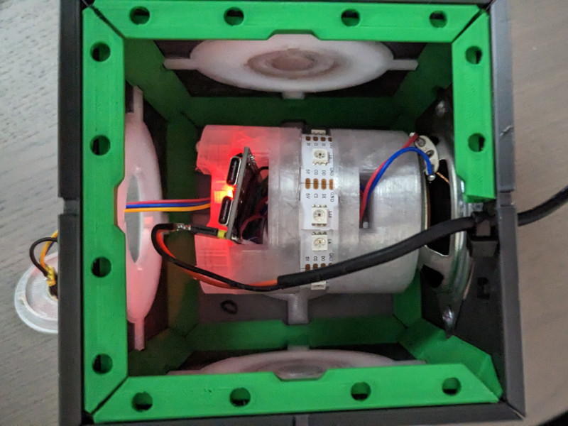
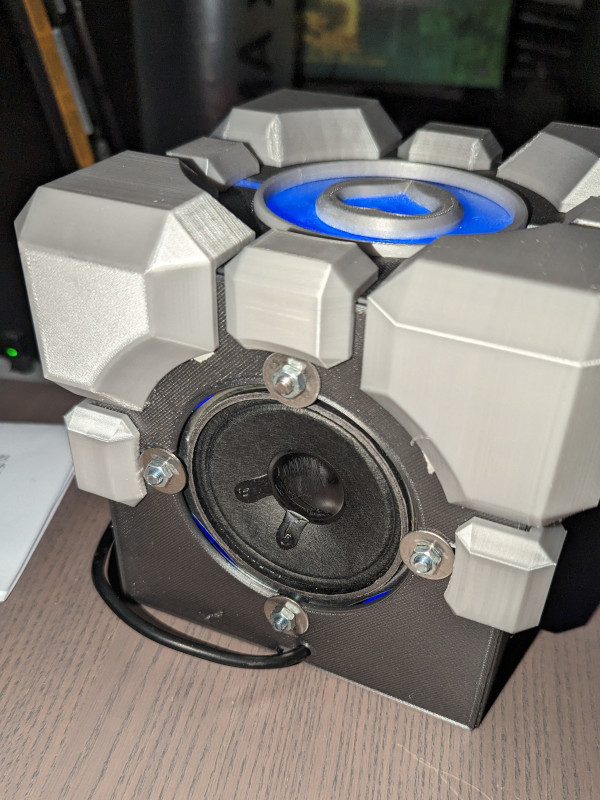

# Voice Assistant for HA

After playing around with different hardwares and the settings (see [here](https://github.com/FlorianBr/ESPHome.Assist)) I started to create a (more or less) final voice assistant including case and so on

## The case

The case is based on a 3D printed Companion Cube made by woodyhead101 available on [thingiverse](https://www.thingiverse.com/thing:6468441)

Most of the outer parts are not modified, there is only one exception: For the microphone I modified one of the Aperture-Inlays. I did that in the slicer it self, so there is no 3D File for that.

Besides that I added holders for the ESP32, LED strip and the amplifiers. The speaker is screwed to the backwards facing plate and the other components hold by 3D printed parts stacked onto the speaker. The parts are far from perfect, but it works. But next time I would design it differently...

## The hardware

The ESP32 is a chinese clone of Espressifs ESP32-S3-DevKitC with slightly different pinning. The on-board RGB-LED is at IO48 instead of IO38 for example.

On the breadboard I still have an additional LED and a button, both removed in the final design. Also the led strip is longer.

### Pinnings

#### MAX98357

- LRC  - ESP32 GPIO46
- BCK  - ESP32 GPIO9
- DIN  - ESP32 GPIO10
- GAIN - not connected
- SD   - VDD (Channel left selected)
- GND  - GND
- VDD  - ESP32 3v3

#### INMP441

- SCK - ESP32 GPIO21
- WS  - ESP32 GPIO20
- L/R - GND
- SO  - ESP32 GPIO19
- VDD - ESP32 3v3
- GND - GND

#### LED Strip

- 5V  - 5V
- CI  - ESP32 GPIO5
- DI  - ESP32 GPIO4
- GND - GND

#### ESP32

- GPIO4  - LED Strip DI
- GPIO5  - LED Strip CI
- GPIO9  - MAX98357 BCK
- GPIO10 - MAX98357 DIN
- GPIO19 - INMP441 SO
- GPIO20 - INMP441 WS
- GPIO21 - INMP441 SCK
- GPIO46 - MAX98357 LRC
- GPIO48 - On-Board RGB-LED

## The software

### Local Wake word

The ESP is powerful enough for micro_wake_word, meaning: The detection of the wake word runs directly on the ESP32. Instead of the official models I use a model found in [Florian Wartner Collection](https://github.com/fwartner/home-assistant-wakewords-collection), and added the necessary JSON to use it.

For your own training have a look at the Docs [here](https://github.com/kahrendt/microWakeWord) and [here](https://github.com/dscripka/openWakeWord)

⚠️ :warning: Work in progress! Not yet working!

### States, Conditions and Light

States:

| Name      | Condition                   | LED-Ring           |
|-----------|-----------------------------|--------------------|
| starting  | Power-On                    | Red, rotating      |
| idle      | VA is ready, waiting for WW | Off                |
| wakeword  | WW detected                 | Green              |
| VA start  | VA is starting              | Orange             |
| listening | VA is listening             | Green, fast pulse  |
| thinking  | Parsing audio data          | Orange, fast pulse |
| replying  | VA is answering             | Blue               |
| error     | Generic/unknown error       | Red, Fast Pulse    |
| muted     | WakeWord detection OFF      | Red, Slow Pulse    |

TODO:

- [X] Put the confirmation MP3 in the ESPs flash
- [ ] Custom wake-word
- [ ] Better state changes and doc of states
- [ ] Improve mic performance
- [ ] Use the Onboard-LED for something useful
